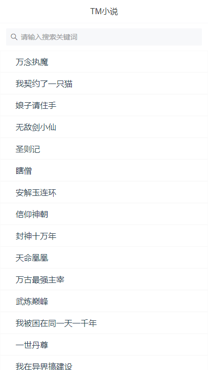
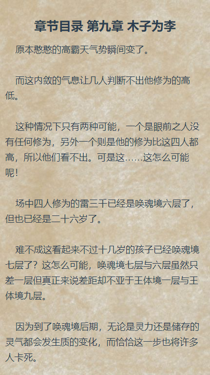

# TM小说

## 配置：

- vue：2.6.10
- vue-router：3.13
- vuex：3.12
- vant：2.4.2
- axios：0.19.1

## 文件：

> http目录下的index.js修改自己的接口地址

## 后端接口

https://github.com/xygengcn/TMNovel-Api

## DEMO：

https://tm.xygeng.cn/

## 效果图：



### 初始化

```
npm install
```

### 启动

```
npm start
```

### ### 打包
```
npm run build
```


## 问题

- 刷新问题出现404：

nginx解决：

```
location / {
  try_files $uri $uri/ /index.html;
}
```

