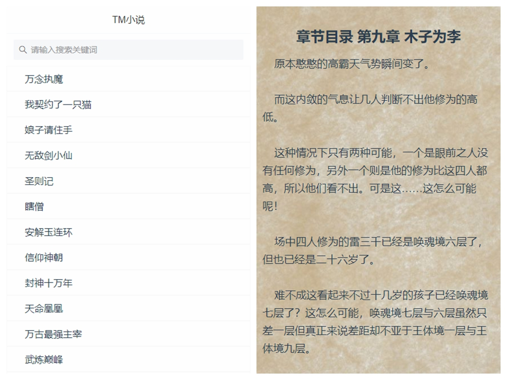

# TM小说

## 简介

平时喜欢看小说，ios有爱阅可以看，奈何广告也来越多，所以简单写了一个小网站，小说资源从网络小说网站拿的，可能速度上比较慢，正在想办法缓存一下。小说就三个界面，小说书单，小说介绍，小说章节，主要是php爬取，vue前端界面，比较简单。

## 配置：

- vue：2.6.10
- vue-router：3.13
- vuex：3.12
- vant：2.4.2
- axios：0.19.1

## 文件：

> http目录下的index.js修改自己的接口地址

## 源码

后端：https://github.com/xygengcn/TMNovel-Api

前端：https://github.com/xygengcn/vue-TMNovel

## DEMO：

https://tm.xygeng.cn/

## 效果图：



### 初始化

```
npm install
```

### 启动

```
npm start
```

### ### 打包
```
npm run build
```


## 问题

- 刷新问题出现404：

nginx解决：

```
location / {
  try_files $uri $uri/ /index.html;
}
```

